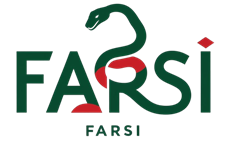

# Farsi PL (Programming Language)

Transform your code into Persian with FarsiLang! This VSCode extension brings a unique programming experience by replacing Python’s keywords with their Persian counterparts. Whether you're a beginner or a pro, write and run your Python-inspired code in a language that feels closer to home. Say goodbye to language barriers and hello to FarsiLang!
## Documentation

For Guide & Documentation [Click Here](https://github.com/soodi592/Farsi/blob/main/Doc.md).


## Installation

To install and run this programming language, you must have Python (Version 3.8 or higher) and its extensions, plus the library specific to this language.\
\
[Python installation link](https://www.python.org/downloads/)\
\
[Library installation link](https://pypi.org/project/farsilang/0.1/)
## Usage/Examples

* Example number 1
```farsi
تعریف سلام():
    چاپ("سلام دنیا")

سلام()
```

* Example No.2
```farsi
اگر ۱ + ۲ == ۳:
    چاپ("منطق صحیح است.")
وگرنه:
    چاپ("منطق نادرست است.")
```
## Support

For support, email soodi.592.ali@gmail.com.

